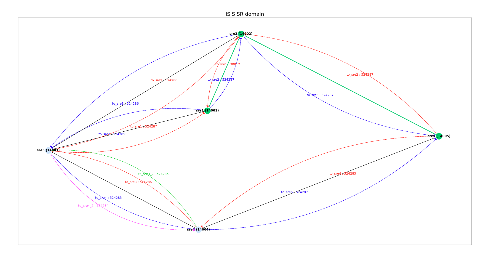

# Intro

The scipt is used to visualise ISIS Segment Routing domain, while provides number of options, Node-SID/Interface/Adj-SID labels, simple SFP path calulation and adjacency SID matrix.
The script desined for use with Nokia 7x50 router and can be used in the lab environment to quickly visualise ISIS Segment Routing domain.
Tested using SROS 23.3.R2.
```sh
A:admin@sre3# show version
TiMOS-B-23.3.R2 both/x86_64 Nokia 7750 SR Copyright (c) 2000-2023 Nokia.
All rights reserved. All use subject to applicable license agreements.
```

# Prerequisites

NETCONF configured on all nodes of SR domain. Configuration example could be found [here](netconf_example.cfg).

NETCONF user should have the following GNMI paths accessible in R/O mode:
```
'/nokia-state:state/port[port-id=PORT]/hardware-mac-address'
'/configure/router[router-name=Base]/interface[interface-name=INTERFACE]'
'/nokia-state:state/router[router-name="Base"]/isis[isis-instance="0"]'
'/configure/router[router-name=Base]/mpls-labels/sr-labels'
```

# Limitations

 - ISIS instance number should be 0.
 - Supports not more than two p2p interfaces between the same pair of routers.
 - Supports P2P interfaces only.

# Usage

```sh
usage: main.py [-h] [-c CONFIG] [-y YANG] [-n NPORT] [-u USER] [-p PWD] [-a] [-g] [-s SRC] [-d DST]

Draw ISIS SR domain graph.

options:
  -h, --help            show this help message and exit
  -c CONFIG, --config CONFIG
                        Configuration file name.
  -y YANG, --yang YANG  YANG models directory.
  -n NPORT, --nport NPORT
                        default NETCONF port.
  -u USER, --user USER  default NETCONF username.
  -p PWD, --pwd PWD     default NETCONF password.
  -a, --adjmatrix       Adjacency matrix.
  -g, --graph           Draw Graph.
  -s SRC, --src SRC     Source node.
  -d DST, --dst DST     Destination node.
```
## Drawing Graph

```sh
$ /Users/azyablov/py/ISIS_SRexplorer/main.py -g -s sre1 -d sre5
Path from sre1 (14001) to sre5 (14005): [<Name: sre1, SystemID: 0100.0000.0001>, <Name: sre2, SystemID: 0100.0000.0002>, <Name: sre5, SystemID: 0100.0000.0005>]

```

On the picutre below graph is reflecting network topology, directional adjacencies, Node- and Adj-SIDs, interface names and highligh reqeusted SPF path between nodes sre1 -> sre5.



## Getting Adjacency Martix and SFP Path

```sh
$ /Users/azyablov/py/ISIS_SRexplorer/main.py -a -s sre1 -d sre5
Adjacency matrix:
                                        | sre1 (14001) -> sre2 (14002): 524287    | sre1 (14001) -> sre3 (14003): 524285    |                                         |                                         | 

sre2 (14002) -> sre1 (14001): 30012     |                                         | sre2 (14002) -> sre3 (14003): 524286    |                                         | sre2 (14002) -> sre5 (14005): 524287    | 

sre3 (14003) -> sre1 (14001): 524287    | sre3 (14003) -> sre2 (14002): 524286    |                                         | sre3 (14003) -> sre4 (14004): 524285    |                                         | 

                                        |                                         | sre4 (14004) -> sre3 (14003): 524286    |                                         | sre4 (14004) -> sre5 (14005): 524287    | 

                                        | sre5 (14005) -> sre2 (14002): 524287    |                                         | sre5 (14005) -> sre4 (14004): 524285    |                                         | 

Path from sre1 (14001) to sre5 (14005): [<Name: sre1, SystemID: 0100.0000.0001>, <Name: sre2, SystemID: 0100.0000.0002>, <Name: sre5, SystemID: 0100.0000.0005>]
```


# Configuration File

Configurarion is quite straghtforward. Root node is mandatory since used extract key parameters like SRGB.
If username, password and / or port aren't provided in the file, then it could be specified via CLI parmeter as default value.
Default value for NETCONF port is 830.

```yaml
root:
  host: 127.0.0.1
  user: 'netconf'
  pwd: 'nokia123'
  netconf_port: 1831
nodes:
# sre2
  - host: 127.0.0.1
    user: 'netconf'
    pwd: 'nokia123'
    netconf_port: 1832
# sre3
  - host: 127.0.0.1
    user: 'netconf'
    pwd: 'nokia123'
    netconf_port: 1833
# sre4
  - host: 127.0.0.1
    user: 'netconf'
    pwd: 'nokia123'
    netconf_port: 1834
# sre5
  - host: 127.0.0.1
    user: 'netconf'
    pwd: 'nokia123'
    netconf_port: 1835

```
